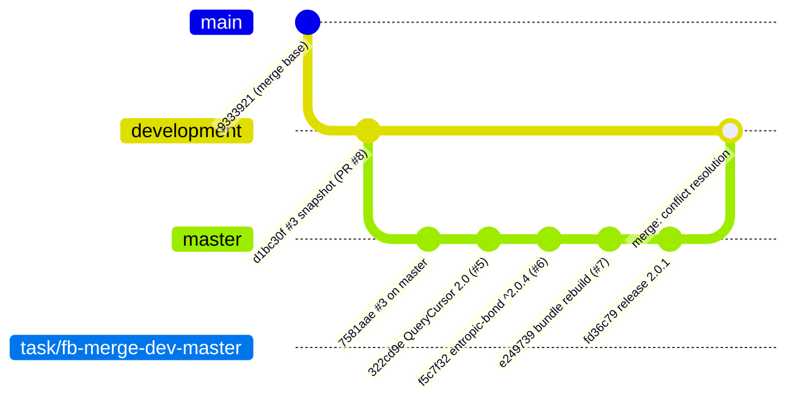

# Design — Merge `development` into `master` (fb-merge-dev-master)

## Abstract

Integrates `origin/development` (issue #3 full-snapshot listener, PR #8) into
`master` (QueryCursor 2.0 API #5, `entropic-bond` ^2.0.4 #6, bundle rebuild #7,
releases, and master's own #3 fix `7581aae`). Four files conflict:
`package.json`, `package-lock.json`, `src/store/firebase-datasource.ts`,
`src/store/firebase-datasource.spec.ts`. The resolution keeps master's release
state and 2.0 API, and ports everything dev-only that master lacks: the
`src/store/specs/gh-issue-3/` artifacts, the listener JSDoc, and the stricter
gh-issue-3 listener tests.

## Data flow

## Conflict resolutions

| File | Resolution | Why |
| --- | --- | --- |
| `package.json` | Take master's (`entropic-bond` ^2.0.4, version 2.0.1, vite/firebase bumps) | Dev's only change is the ^1.61.1 bump, subsumed by ^2.0.4 ([REQ-1]) |
| `package-lock.json` | Take master's | Lock must match the kept manifest; dev's only delta is the 1.61.1 pin ([REQ-2]) |
| `src/store/firebase-datasource.ts` | Master's QueryCursor 2.0 file + port dev's two JSDoc blocks | Master already passes the full snapshot (`7581aae`); dev's listener-semantics documentation is missing and is asserted by gh-issue-3 [REQ-4] |
| `src/store/firebase-datasource.spec.ts` | Master's gh-issue-4 pagination tests + dev's gh-issue-3 listener tests (REQ-1…REQ-4) | Dev's listener tests are a stricter superset of master's two rewritten listener tests (waitFor + exact snapshot instead of post-hoc assertions) ([REQ-3], [REQ-5]) |

Auto-merged without conflict: `src/store/specs/gh-issue-3/` (dev-only, kept),
`src/store/specs/gh-issue-4/` (master-only, kept), `AGENTS.md` (master's
notification-section removal wins — dev untouched), `CHANGELOG.md`,
`functions/*`, `src/firebase-helper.ts`, `vite.config.ts`.

## Plan

1. Commit these specs (spec-first, TDD gate).
2. `git merge origin/master`, resolve the four conflicts as above.
3. Add `specs/merge-dev-master/merge-invariants.spec.ts` covering [REQ-1],
   [REQ-2], [REQ-4] as automated tests; [REQ-3], [REQ-5], [REQ-8] are covered
   by the existing suites, [REQ-6]/[REQ-7]/[REQ-9] by command verification.
4. `npm ci`, `npx tsc --noEmit`, `npm test`, `npm run build`.
5. Audit (`code-auditor`) against the feature file and modified sources.
6. Push, open PRs, write the report.

## Proposed changes

| File | Change |
| --- | --- |
| `specs/merge-dev-master/merge-dev-master.feature` | New — merge requirements |
| `specs/merge-dev-master/merge-dev-master-design.md` | New — this document |
| `specs/merge-dev-master/merge-invariants.spec.ts` | New — automated [REQ-1]/[REQ-2]/[REQ-4] invariants |
| `package.json`, `package-lock.json` | Conflict → master's versions |
| `src/store/firebase-datasource.ts` | Conflict → master + ported listener JSDoc |
| `src/store/firebase-datasource.spec.ts` | Conflict → master's pagination tests + ported listener tests |
| `src/store/specs/gh-issue-3/` | Ported from development unchanged except API-sensitive wording in the design doc |

## Strengths and weaknesses

- Strengths: master's released state is taken wholesale (zero downgrade risk);
  dev's contribution lands as documentation + stricter tests, both of which are
  already asserted on the merged code, so the port is verifiable, not blind.
- Strengths: the merge commit keeps both parents, history preserves both
  sides ([REQ-9]).
- Weaknesses: the gh-issue-3 design doc still narrates the ^1.61.1 bump
  decision; its dependency-bump paragraph is adapted to the merged ^2.0.4
  reality so the document does not contradict the tree.

## Audit note (code-auditor, step 2 — no major improvements detected)

- **Overview**: the merged `FirebaseDatasource` is master's released QueryCursor
  2.0 implementation plus the ported listener JSDoc; pagination state is fully
  cursor-local, listeners add no state, and the snapshot second argument reuses
  the incoming `QuerySnapshot`. No architectural friction attributable to the
  merge was found, so no refactors were applied (nothing was left unstaged).
- **Files**: `src/store/firebase-datasource.ts`, `package.json`,
  `package-lock.json`, `src/store/specs/gh-issue-3/*`,
  `specs/merge-dev-master/*`.
- **Requirement traceability**: [REQ-1] [REQ-2] [REQ-4] →
  `specs/merge-dev-master/merge-invariants.spec.ts`; [REQ-3] → gh-issue-4
  [REQ-2…4] pagination tests; [REQ-5] → gh-issue-3 [REQ-1…4] listener tests;
  [REQ-6] `npx tsc --noEmit`; [REQ-7] `npm run build`; [REQ-8] `npm test`;
  [REQ-9] merge commit `6e268d6` parents `abd70a0` (development lineage) and
  `fd36c79` (master).
- **Recommendation strength — Worth exploring**: `count()` no longer honours
  `queryObject.limit` since the QueryCursor migration moved `limit` out of
  `queryObjectToQueryConstraints`, so a limited query counts the whole match
  set. This is master's pre-existing released behavior, out of the merge's
  scope; flagged for a follow-up issue.
- **Recommendation strength — Speculative**: the snapshot array is re-mapped on
  every notification (allocation per snapshot; already noted in the gh-issue-3
  design doc) and collection deltas carry `params: {}` while document deltas
  carry Firestore metadata.
