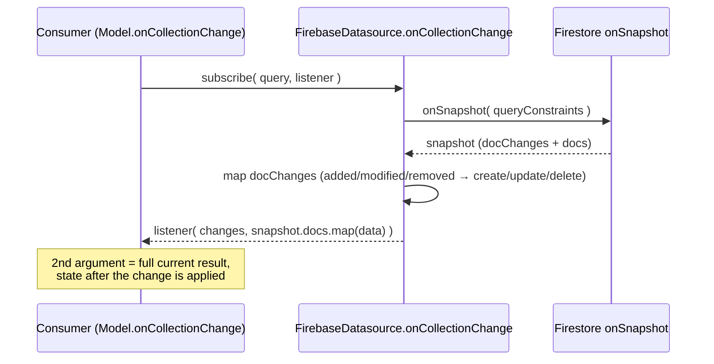

# Design — Full query snapshot in onCollectionChange (gh-issue-3)

GitHub issue: https://github.com/entropic-bond/entropic-bond-firebase/issues/3

## Abstract

`FirebaseDatasource.onCollectionChange` currently forwards only the delta
changes to the listener (`listener( changes )`), while the core library
(entropic-bond ≥ 1.61.0, core entropic-bond#12 / commit `155bb84`) defines
`CollectionChangeListener<T> = ( changes: DocumentChange<T>[], snapshot?: T[] ) => void`.
This change passes the full current query result as the second argument,
documents the before/after/snapshot semantics of both listeners, and bumps the
`entropic-bond` dependency to a release that declares the two-argument
contract. (Merge note: on the merged tree the dependency stays on `master`'s
`entropic-bond` ^2.0.x range — ^2.0.4 at merge time, since bumped to ^2.0.5 —
which is ≥ 1.61.0 and therefore already declares the
contract; the development-side ^1.61.1 bump is superseded.)

## Data flow

## Strategy evaluated

- **A — pass `snapshot.docs.map( d => d.data() )` as second argument (chosen)**:
  exactly the core contract; the Firestore `QuerySnapshot` already is the full
  current result set after the change was applied, so no local bookkeeping is
  needed.
- **B — keep local state and rebuild the result set from the deltas**:
  duplicates what Firestore already provides, risks drift on limit/ordering
  queries. Rejected.

## Decisions and notes

- **`delete()` performs no local notification (intentional).** Firestore's
  realtime `onSnapshot` stream reports the removal to every subscribed listener
  (mapped to `type: 'delete'`, covered by [REQ-2]); a local echo would deliver
  the removal twice.
- **`onDocumentChange` already surfaces `type: 'delete'`** (gh-issue-2,
  commit `114f0db`); its `before`/`after` semantics were undocumented — now
  stated in JSDoc ([REQ-4]). `before` is always `undefined`: Firestore
  snapshots carry no previous document state.
- **Dependency bump.** `entropic-bond` is raised from `^1.60.2` to `^1.61.1`
  (v1.61.0 is the first release containing the snapshot contract). A larger
  bump to `^2.0.x` would also require the QueryCursor migration (PR #5), which
  was out of scope for this issue. On the merged tree the QueryCursor
  migration is present, so `master`'s ^2.0.x range is kept (^2.0.5 after the
  post-merge bump) — it satisfies the
  ≥ 1.61.0 contract and the ^1.61.1 bump is dropped. Per the standing rule,
  dependency bumps do not get specs or tests. `functions/` does not consume
  the listener types, so its manifest is untouched.
- **Specs live only in the `.feature` file** (the scenario *is* the
  requirement); this document carries the design decisions.

## Proposed changes

| File | Change |
| --- | --- |
| `src/store/firebase-datasource.ts` | Pass `snapshot.docs.map(...)` as 2nd listener argument in `onCollectionChange` ([REQ-1], [REQ-2], [REQ-3]); JSDoc for `onCollectionChange` and `onDocumentChange` ([REQ-4]) |
| `src/store/firebase-datasource.spec.ts` | Rewrite collection-listener tests for [REQ-1]…[REQ-3], enable the skipped deletion test, add [REQ-4] doc test |
| `package.json`, `package-lock.json` | `entropic-bond` `^1.60.2` → `^1.61.1` |
| `src/store/specs/gh-issue-3/gh-issue-3.feature` | New — requirements |

## Tasks (TDD)

1. Add failing tests for [REQ-1]…[REQ-4] in `src/store/firebase-datasource.spec.ts`.
2. Implement the snapshot argument + JSDoc and bump `entropic-bond`.
3. Run the emulator suite, `tsc --noEmit`, and the build gates.

## Strengths and weaknesses

Strengths:
- One-line behavioral change; reuses the Firestore `QuerySnapshot` the
  callback already receives — no new state, no drift.
- Aligns the plugin with the core removal semantics and with `master`
  (commit `7581aae`), so future merges are conflict-free on this file.
- Deletion test un-skipped, covering the previously untested `removed →
  'delete'` mapping.

Weaknesses:
- Snapshot arrays are re-mapped on every notification (allocation per
  snapshot) — negligible for the query sizes this API targets.
- ~~The `^1.61.1` range will diverge from `master`'s `^2.0.4` until the
  QueryCursor migration lands on `development`.~~ Resolved by the merge: one
  range (^2.0.5 after the post-merge bump) and the QueryCursor migration are
  both in the merged tree.

## Audit note (code-auditor, step 2 — no major improvements detected)

- `before` is always `undefined` in this plugin, while the core
  `JsonDataSource` fills it for removals; the JSDoc now states this, but the
  two plugins still differ (`Speculative`).
- The inline `added/modified/removed → create/update/delete` ternary chain
  would be worth extracting only if a third listener mapping appears
  (`Speculative`).
- Collection changes carry `params: {}` while document changes carry
  Firestore metadata + `exists`; consumers cannot introspect metadata on
  collection deltas (`Worth exploring`).
- No refactors applied: the change reuses the incoming `QuerySnapshot`, adds
  no state, and matches the core listener contract. Tests re-run GREEN after
  the audit.
